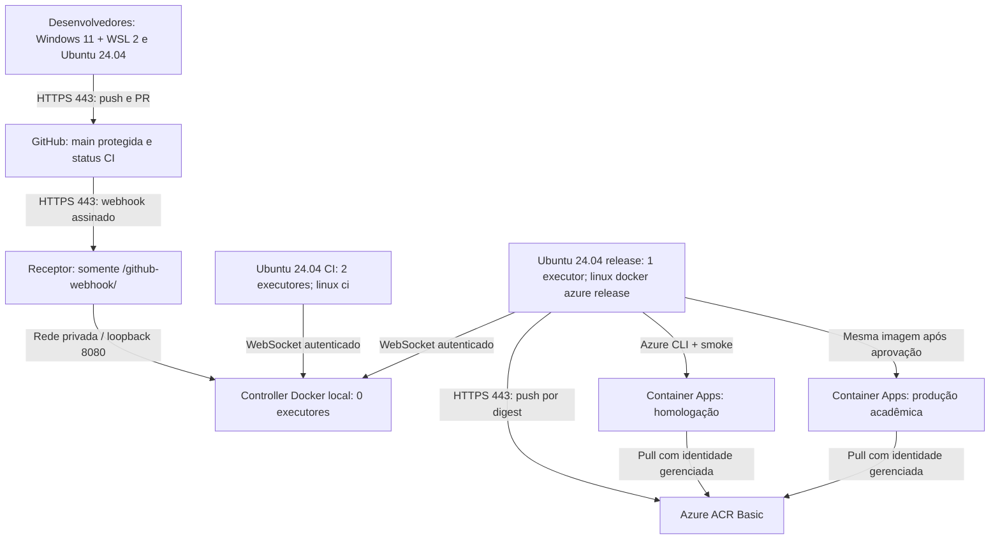

# E1 · Arquitetura Jenkins da Carparts

| Nó | Local/SO | Executores | Rótulos | Função |
|---|---|---:|---|---|
| Controller | Docker Linux em host Ubuntu 24.04 ou WSL 2, on-premises | 0 | exclusivo | Agenda, JCasC, credenciais e histórico |
| Agente CI | Ubuntu 24.04 | 2 | `linux ci` | Lint/testes; sem credenciais Azure |
| Agente release | Ubuntu 24.04 | 1 | `linux docker azure release` | Imagem, ACR, deploy e smoke |
| Estações Windows | Windows 11 + WSL 2 | 0 | desenvolvimento | Não são necessárias para build desta API Linux |

Portas: 8080 somente em loopback/rede privada; 443 para GitHub/Azure; 22 apenas para túnel administrativo; porta TCP 50000 desativada. Agentes usam WebSocket autenticado. O endpoint público encaminha somente webhook assinado, nunca a interface do Jenkins.

## Justificativa e comparação

| Critério | Docker local, escolhido | VM Azure | AKS |
|---|---|---|---|
| Dados ERP | Controller permanece on-premises | Exige conexão e segregação adicionais | Maior superfície e operação |
| Custo Azure | Apenas ACR e Container Apps | Acrescenta VM, disco e rede | Acrescenta cluster, nós e discos |
| Operação | Backup do volume e atualização LTS | NSG, SO, backup e disponibilidade | Kubernetes, RBAC e storage |
| Adequação | Coerente com equipe pequena e teto US$150 | Alternativa futura após cotação | Complexidade desproporcional |

O controller local preserva a restrição on-premises e reduz custo de nuvem. O risco é depender do host local; mitigar com backup criptografado privado do `JENKINS_HOME`, restauração testada, atualização controlada e acesso administrativo restrito.
